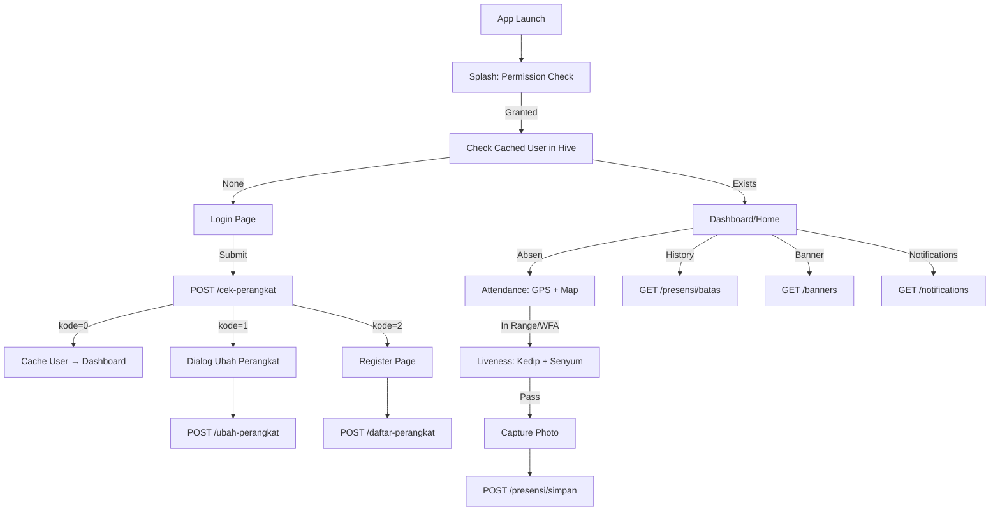

# 📋 E-Presensi Mobile — Dokumen Requirement Lengkap

> **Versi Aplikasi:** 3.2.2+54  
> **Platform:** Flutter (Android & iOS)  
> **Base URL API:** `https://epresensimobile.bengkuluprov.go.id/api` (v3 endpoints di-prefix `/v3/`)  
> **Tanggal Dokumen:** 13 Mei 2026

---

## 1. Deskripsi Umum Aplikasi

**E-Presensi Mobile** adalah aplikasi presensi (absensi) digital untuk pegawai Pemerintah Provinsi Bengkulu. Aplikasi ini memungkinkan pegawai melakukan absensi masuk/pulang menggunakan smartphone dengan validasi lokasi GPS, verifikasi wajah (liveness detection + face recognition), dan pengikatan perangkat (device binding).

---

## 2. Arsitektur & Pola Desain

### 2.1 Clean Architecture (3 Layer per Feature)

```
lib/
├── api/              → URL endpoint constants
├── app/              → App config, routing, providers
├── core/             → Shared (DI, network, services, themes, utils, error)
└── features/
    ├── auth/         → Login, register device, change device
    ├── attendance/   → Submit presensi (lokasi + foto + face)
    ├── history/      → Riwayat presensi bulanan & harian
    ├── banner/       → Pengumuman/banner
    ├── notification/ → Notifikasi terjadwal
    ├── home/         → Halaman utama (dashboard info)
    ├── dashboard/    → Bottom nav container
    ├── profile/      → Profil pegawai & about
    ├── activity/     → Halaman aktivitas
    └── splash/       → Splash screen + permission check
```

Setiap feature menggunakan pola:
- **Data Layer:** DataSource (Remote/Local) → Model → Repository Implementation
- **Domain Layer:** Entity → Repository (abstract) → UseCase
- **Presentation Layer:** Bloc/Cubit → State → Page/Widget

### 2.2 State Management
- **flutter_bloc** (BLoC & Cubit pattern)
- `AuthCubit` — status autentikasi global
- `LoginBloc` — proses login
- `AttendanceCubit` — proses presensi
- `HistoryCubit` / `LogCubit` — riwayat
- `BannerCubit` — pengumuman
- `NotificationCubit` — notifikasi terjadwal
- `ConnectivityCubit` — status koneksi internet

### 2.3 Navigasi
- **go_router** dengan named routes
- Routes: `/splash`, `/login`, `/register`, `/home`, `/attendance`, `/banner`, `/banner-detail`, `/history-detail`, `/webview`, `/about`

### 2.4 Local Storage
- **Hive** — menyimpan data user (auth_box) dan settings (settings_box)
- **SharedPreferences** — remember me (username & password)

---

## 3. Alur Aplikasi (Flow)

### 3.1 Startup Flow

```
App Launch
  → Firebase.initializeApp()
  → ServiceLocator.init()
      → Hive init (auth_box, settings_box)
      → NetworkInfo init
      → Crashlytics init
      → NotificationService init
      → Locale init (id_ID)
  → SplashPage
      → Cek Permission (Camera + Location)
         → Jika belum → Tampilkan UI minta izin
         → Jika sudah → Cek AuthStatus dari Hive
             → Ada cached user → /home (DashboardPage)
             → Tidak ada → /login
```

### 3.2 Login Flow

```
LoginPage
  → SecurityService.getSecurityThreats() [root/emulator/devMode check]
     → Jika ada ancaman → tampilkan dialog peringatan (user bisa skip)
  → User input username + password
  → DeviceUtils.getDeviceInfo() → ambil kode_unik, merek, model, fingerprint
  → POST /cek-perangkat {kode_unik, username, password}
     → kode=0 → Login sukses → Cache user ke Hive
                → POST /users-block/check {nip} → cek apakah user diblokir
                → AuthCubit.loggedIn(user) → navigasi ke /home
     → kode=1 → DeviceMismatchException → tampilkan dialog "Ubah Perangkat"
                → POST /ubah-perangkat {nip, kode_unik, merek, model, fingerprint}
     → kode=2 → UserNotRegisteredException → navigasi ke /register
                → POST /daftar-perangkat (multipart: nip, kode_unik, merek, model, fingerprint, foto)
     → kode=3 → ContactAdminException → tampilkan pesan "Hubungi Admin"
```

### 3.3 Presensi (Attendance) Flow

```
User tap "Absen Sekarang" di HomePage
  → /attendance (AttendancePage)
  → Initialize:
      1. Load model TFLite (MobileFaceNet)
      2. Cek GPS service & permission
      3. Load koordinat kantor dari user.daftarKordinat
      4. Render Google Maps + circles (radius 20m) + polygons
      5. Start location tracking (real-time stream, distanceFilter: 5m)
  → Hitung jarak ke kantor terdekat
  → Cek posisi: dalam radius/polygon ATAU WFA (Work From Anywhere)
     → Jika di dalam / WFA → tombol "Lanjutkan Presensi" aktif
     → Jika di luar → tampilkan warning, tombol disable
  → Tap "Lanjutkan Presensi"
  → AttendanceLivenessPage (Verifikasi Wajah):
      1. Buka kamera depan
      2. ML Kit Face Detection (real-time image stream)
      3. Step 1: Deteksi kedipan mata (eyeOpenProbability < 0.35)
      4. Step 2: Deteksi senyuman (smilingProbability > 0.45)
      5. Auto-capture foto setelah liveness pass
      6. Review foto → "Foto Ulang" atau "Kirim Absen"
  → Submit Attendance:
      1. Ambil device info (merek, model)
      2. Capture GPS Snapshot (lokasi, device_state, environment, raw)
      3. Generate face embedding via TFLite MobileFaceNet (112x112 → 192-dim vector)
      4. Compress image jika > 5MB
      5. POST /presensi/simpan (multipart)
      6. Tampilkan hasil sukses/gagal
```

### 3.4 Lifecycle & Security

- **App ke background/inactive** → auto logout (clear Hive data) → redirect ke login saat resume
- **App terminated (detached)** → force logout
- Config `LifecycleConfig.ignoreBackgroundLogout` untuk skip behavior ini saat tertentu
- **Security checks** saat login: root/jailbreak, emulator, developer mode
- **Screen blur** saat app di background (privacy protection)
- **Portrait-only** orientation

---

## 4. Data yang Dibutuhkan Agar Aplikasi Berjalan Lancar

### 4.1 Konfigurasi Server/Backend & Infrastruktur

| Data | Keterangan |
|------|-----------|
| Base URL API Root | `https://epresensimobile.bengkuluprov.go.id/api` |
| Prefix Path API v3 | `/v3` (Digunakan khusus untuk endpoint banners, notifications, version-mobile, users-block) |
| Firebase Project | Untuk Crashlytics, Analytics, Performance Monitoring |
| Google Maps API Key | Untuk menampilkan peta Google Maps di halaman presensi |
| TFLite Model | `mobile_face_net.tflite` (bundled di assets aplikasi) |
| Audio Files | `audio/kedip.MP3`, `audio/senyum.MP3` ( bundled di assets aplikasi) |
| Image Assets | Logo, background, branding images |

#### Security & SSL Pinning Requirements
Aplikasi mobile mengimplementasikan **SSL SPKI Public Key Pinning (SHA-256)** via `PinnedHttpClient`. Backend server **WAJIB** menjaga rantai sertifikat SSL (AWS ACM / CA) agar sesuai dengan SHA-256 hash berikut:
- **Leaf Certificate Pin:** `Go6Yu/bl7FLqTH0SHuWhONAM92dahY9a7mPf8rIqrFs=` (`devepresensimobile.bengkuluprov.go.id` / `epresensimobile.bengkuluprov.go.id`)
- **Intermediate CA Pin:** `G9LNNAql897egYsabashkzUCTEJkWBzgoEtk8X/678c=` (Amazon RSA 2048 M04)
- **Root CA Pin:** `++MBgDH5WGvL9Bcn5Be30cRcL0f5O+NyoXuWtQdX1aI=` (Amazon Root CA 1)
- **Allowed Hosts:** `bengkuluprov.go.id`, `devepresensimobile.bengkuluprov.go.id`, `epresensimobile.bengkuluprov.go.id`

#### Timeout & SLA Limits
- **Autentikasi, Riwayat & Konfigurasi API:** Response time maksimal **30 detik**.
- **Submit Presensi (Upload Foto):** Response time maksimal **60 detik**.
- **Version Check & User Block:** Response time maksimal **15 detik** (dengan pola *fail-open* jika timeout).

---

### 4.2 Permission Perangkat

| Permission | Kegunaan |
|-----------|---------|
| **Camera** | Foto selfie presensi + liveness detection |
| **Location (GPS)** | Validasi lokasi presensi (real-time high accuracy) |
| **Notification** | Pengingat jadwal absen |
| **Internet** | Komunikasi dengan API server |

---

### 4.3 Data Pegawai (dari API saat Login)

| Field | Tipe | Keterangan |
|-------|------|-----------|
| `detail_pegawai.id` | String | ID pegawai |
| `detail_pegawai.nip` | String | NIP pegawai |
| `detail_pegawai.nama` | String | Nama lengkap |
| `detail_pegawai.email` | String | Email |
| `detail_pegawai.jenis_kelamin` | String | L/P |
| `detail_pegawai.jabatan_nama` | String | Nama jabatan |
| `detail_pegawai.unor.nama_unor` | String | Unit organisasi |
| `detail_pegawai.unor.id` | String | ID unit organisasi |
| `detail_pegawai.unor_induk.nama_unor` | String | Unor induk |
| `token` | String (Opsional) | Bearer auth token untuk otentikasi request berikutnya |
| `face_recognition` | List/Array (Opsional) | Embedding wajah tersimpan |

---

### 4.4 Data Koordinat Kantor (dari API saat Login)

| Field | Tipe | Keterangan |
|-------|------|-----------|
| `daftar_kordinat[].id` | int | ID lokasi |
| `daftar_kordinat[].nama_tempat` | String | Nama tempat/kantor |
| `daftar_kordinat[].latitude` | String | Latitude pusat |
| `daftar_kordinat[].longitude` | String | Longitude pusat |
| `daftar_kordinat[].alamat` | String | Alamat |
| `daftar_kordinat[].radius_meter` | int/float | Radius zona absen dalam meter |
| `daftar_kordinat[].polygon_points[]` | List | Titik-titik polygon area |
| `polygon_points[].latitude` | String | Lat titik polygon |
| `polygon_points[].longitude` | String | Lng titik polygon |
| `polygon_points[].urutan` | int | Urutan titik |

---

### 4.5 Data Jadwal & Konfigurasi

| Field | Tipe | Keterangan |
|-------|------|-----------|
| `hasil_login.jadwal_absen.masuk_jam` | String (HH:mm:ss) | Jam masuk |
| `hasil_login.jadwal_absen.masuk_batas` | String (HH:mm:ss) | Batas masuk |
| `hasil_login.jadwal_absen.pulang_jam` | String (HH:mm:ss) | Jam pulang |
| `hasil_login.jadwal_absen.pulang_batas` | String (HH:mm:ss) | Batas pulang |
| `hasil_login.tipe_absensi` | String | Tipe absen (default "B") |
| `hasil_login.id_mesin` | int | ID mesin presensi |
| `wfa_status` | int | 0=WFO (Work From Office), 1=WFA (Work From Anywhere) |

---

### 4.6 Standar Format Error Response Backend

Jika terjadi kesalahan (HTTP status 4xx, 5xx, atau `kode != 0`), backend **harus** mengembalikan format JSON konsisten agar pesan error dapat ditampilkan dengan ramah ke pengguna:

```json
{
  "kode": 1,
  "error": "Pesan kesalahan spesifik dari server",
  "message": "Pesan alternatif jika error tidak diisi",
  "errors": {
    "field_name": ["Pesan error validasi Laravel/framework"]
  }
}
```

*Urutan ekstraksi error di aplikasi mobile: `error` → `message` → `errors[first_key][0]`.*

---

## 5. API Endpoints & Data yang Diperlukan

### 5.1 POST `/cek-perangkat` — Login / Cek Perangkat

- **URL Full:** `POST https://epresensimobile.bengkuluprov.go.id/api/cek-perangkat`
- **Content-Type:** `multipart/form-data` atau `application/x-www-form-urlencoded`

**Request Body:**
```json
{
  "kode_unik": "device_id_string",
  "username": "nip_pegawai",
  "password": "password"
}
```

**Response Sukses (kode=0, HTTP 200):**
```json
{
  "kode": 0,
  "kode_unik": "device_id",
  "wfa_status": 0,
  "token": "eyJhbGciOiJIUzI1NiIsIn...",
  "detail_pegawai": {
    "id": "123",
    "nip": "199001012020011001",
    "nama": "Nama Pegawai",
    "email": "email@example.com",
    "jenis_kelamin": "L",
    "jabatan_nama": "Analis Data",
    "unor": { "id": "456", "nama_unor": "Bidang IT" },
    "unor_induk": { "nama_unor": "Diskominfotik" }
  },
  "daftar_kordinat": [
    {
      "id": 1,
      "nama_tempat": "Kantor Gubernur",
      "latitude": "-3.792982",
      "longitude": "102.270556",
      "alamat": "Jl. Pembangunan No.1",
      "polygon_points": [
        { "id": 1, "latitude": "-3.792", "longitude": "102.270", "urutan": 1 }
      ]
    }
  ],
  "hasil_login": {
    "nama": "Nama Pegawai",
    "username": "199001012020011001",
    "nip": "199001012020011001",
    "unor_id": "456",
    "id_mesin": 1,
    "tipe_absensi": "B",
    "jadwal_absen": {
      "id": 1,
      "tipe": "reguler",
      "masuk_jam": "07:30:00",
      "masuk_batas": "08:00:00",
      "pulang_jam": "16:00:00",
      "pulang_batas": "16:30:00"
    }
  }
}
```

**Response Error Codes & Status Handled:**
| Status HTTP | kode | Arti | Exception di Mobile |
|-------------|------|------|---------------------|
| 200 | 0 | Sukses Login | — |
| 200 / 403 | 1 | NIP sama, device berbeda | `DeviceMismatchException` → Tampilkan dialog Ubah Perangkat |
| 200 / 403 | 2 | NIP tidak terdaftar di sistem | `UserNotRegisteredException` → Navigasi ke Halaman Register |
| 200 / 403 | 3 | Akun terkunci / Hubungi admin | `ContactAdminException` → Tampilkan pesan "Hubungi Admin" |
| 401 | - | Password/Username Salah | `AuthException` ("Username atau password tidak sesuai") |
| 403 | - | Access Forbidden / Device Mismatch | `DeviceMismatchException` |

---

### 5.2 POST `/ubah-perangkat` — Ubah Perangkat

- **URL Full:** `POST https://epresensimobile.bengkuluprov.go.id/api/ubah-perangkat`
- **Content-Type:** `multipart/form-data`

**Request Body:**
```json
{
  "nip": "199001012020011001",
  "kode_unik": "new_device_id",
  "merek": "Samsung",
  "model": "Galaxy S21",
  "fingerprint": "device_fingerprint"
}
```

**Response Codes:**
| kode | Arti | Action / Field Tambahan |
|------|------|-------------------------|
| 0 | Sukses ubah perangkat | Login diizinkan |
| 1 | Tidak diizinkan (cooldown period) | Harus menyertakan `"tanggal_boleh": "YYYY-MM-DD"` di JSON |
| 2 | Device sudah terdaftar di akun lain | Tampilkan error "Perangkat sudah terdaftar di akun lain" |

---

### 5.3 POST `/daftar-perangkat` — Daftar Perangkat Baru (Multipart)

- **URL Full:** `POST https://epresensimobile.bengkuluprov.go.id/api/daftar-perangkat`
- **Content-Type:** `multipart/form-data`

**Request Body (multipart/form-data):**

| Field | Tipe | Keterangan |
|-------|------|-----------|
| `nip` | String | NIP pegawai |
| `kode_unik` | String | Device ID |
| `merek` | String | Brand device |
| `model` | String | Model device |
| `fingerprint` | String | Device fingerprint |
| `face_recognition` | String | `"[]"` (placeholder embedding) |
| `foto` | File | Foto selfie pendaftaran perangkat (File image) |

**Response:** `{"kode": 0}` (sukses), `{"kode": 1, "error": "..."}` (gagal).

---

### 5.4 POST `/presensi/simpan` — Submit Presensi (Multipart)

- **URL Full:** `POST https://epresensimobile.bengkuluprov.go.id/api/presensi/simpan`
- **Content-Type:** `multipart/form-data`
- **Headers:** `Authorization: Bearer <token>` (dikirim jika token login tersedia)

**Request Body (multipart/form-data):**

| Field | Tipe | Keterangan |
|-------|------|-----------|
| `nip` | String | NIP pegawai |
| `unor_id` | String | ID unit organisasi |
| `kode_unik` | String | Device ID |
| `id_mesin` | String | ID mesin presensi |
| `tipe_absen` | String | Tipe absensi ("B" default) |
| `latitude` | String | Latitude saat absen |
| `longitude` | String | Longitude saat absen |
| `accuracy` | String | Akurasi GPS (dalam meter, contoh: "10.0") |
| `provider` | String | Provider lokasi (contoh: "fused", "gps") |
| `timestamp_device` | String | Timestamp timestamp perangkat (milliseconds) |
| `is_mock_location` | String | Status mock location ("true" / "false") |
| `jarak_kordinat_meter` | String | Jarak ke kantor terdekat (dalam meter) |
| `merek` | String | Brand device |
| `model` | String | Model device |
| `gps_snapshot` | String (JSON) | Snapshot lengkap kondisi GPS & device security state |
| `face_recognition` | String | Vector face embedding 192-dimensi (JSON array string) |
| `token` | String (Opsional) | Token autentikasi pegawai |
| `foto_pegawai` | File | Foto selfie presensi (File image, max 10MB) |

**Struktur JSON `gps_snapshot`:**
```json
{
  "location": {
    "lat": -3.792982,
    "lng": 102.270556,
    "accuracy": 10.0,
    "altitude": 50.0,
    "speed": 0.0,
    "bearing": 0.0,
    "timestamp": 1715583600000
  },
  "device_state": {
    "is_mock_location": false,
    "is_emulator": false,
    "is_rooted": false,
    "developer_mode": false
  },
  "source": { "provider": "fused", "is_mocked": false },
  "environment": { "timezone": "WIB", "network_type": "wifi" },
  "consistency_check": { "speed_anomaly": false },
  "raw": {
    "android_api_level": 33,
    "manufacturer": "Samsung",
    "model": "SM-A536E",
    "brand": "samsung",
    "device": "a53x"
  }
}
```

**Response Sukses (HTTP 200):**
```json
{
  "status": true,
  "message": "Presensi berhasil disimpan"
}
```

---

### 5.5 POST `/presensi/riwayat/range` — Riwayat Presensi (Range Tanggal)

- **URL Full:** `POST https://epresensimobile.bengkuluprov.go.id/api/presensi/riwayat/range`
- **Content-Type:** `multipart/form-data`
- **Headers:** `Authorization: Bearer <token>` (opsional)

**Request Body:**

| Field | Tipe | Keterangan |
|-------|------|-----------|
| `nip` | String | NIP pegawai |
| `awal` | String | Tanggal awal (format: `YYYY-MM-DD`) |
| `akhir` | String | Tanggal akhir (format: `YYYY-MM-DD`) |
| `token` | String (Opsional) | Bearer token |

**Response Sukses (HTTP 200):**
```json
{
  "data": [
    {
      "id": 123,
      "waktu": "2026-05-13 08:00:00",
      "tanggal": "2026-05-13",
      "jam": "08:00:00",
      "latitude": "-3.792982",
      "longitude": "102.270556",
      "lokasi_foto": "path/to/foto.jpg",
      "jarak_kordinat_meter": 15.5,
      "lokasi_foto_url": "https://epresensimobile.bengkuluprov.go.id/storage/foto.jpg"
    }
  ]
}
```

---

### 5.6 GET `/presensi/batas/{nip}/{month}/{year}/{type}` — Log Presensi Bulanan

- **URL Full:** `GET https://epresensimobile.bengkuluprov.go.id/api/presensi/batas/{nip}/{month}/{year}/{type}`
- **Headers:** `Authorization: Bearer <token>` (opsional)

**Path Parameters:**
- `{nip}`: NIP pegawai
- `{month}`: Bulan (1 - 12)
- `{year}`: Tahun (contoh: 2026)
- `{type}`: Tipe log presensi (default: `1` atau `3`)

**Response Sukses (HTTP 200):**
```json
{
  "mobile": [
    {
      "log_data_user_id": "123",
      "log_data_tanggal": "2026-05-13",
      "log_data_jam": "08:00:19 | 16:05:33",
      "log_data_jumlah": "2"
    }
  ]
}
```

---

### 5.7 GET `/v3/banners` — Daftar Banner/Pengumuman

- **URL Full:** `GET https://epresensimobile.bengkuluprov.go.id/api/v3/banners`
- **Headers:** `Accept: application/json`

**Response Sukses (HTTP 200):**
```json
[
  {
    "id": 1,
    "title": "Judul Pengumuman",
    "description": "Deskripsi pengumuman lengkap...",
    "image": "banner.jpg",
    "image_url": "https://epresensimobile.bengkuluprov.go.id/storage/banner.jpg",
    "created_at": "2026-05-01T10:00:00"
  }
]
```

---

### 5.8 GET `/v3/notifications` — Konfigurasi Notifikasi Scheduled

- **URL Full:** `GET https://epresensimobile.bengkuluprov.go.id/api/v3/notifications`
- **Headers:** `Content-Type: application/json`, `Accept: application/json`

**Response Sukses (HTTP 200):**
```json
{
  "success": true,
  "data": [
    {
      "id": 1,
      "title": "Pengingat Absen Masuk",
      "body": "Jangan lupa melakukan presensi masuk hari ini!",
      "timezone": "Asia/Jakarta",
      "schedule": {
        "hour": 7,
        "minute": 30,
        "type": "daily",
        "days": null
      }
    }
  ]
}
```

---

### 5.9 GET `/v3/version-mobile` — Cek Versi Aplikasi

- **URL Full:** `GET https://epresensimobile.bengkuluprov.go.id/api/v3/version-mobile`

**Response Sukses (HTTP 200):**
```json
[
  {
    "latest_version": "3.2.2",
    "minimun_version": "3.0.0",
    "link_playstore": "https://play.google.com/store/apps/details?id=id.go.bengkuluprov.epresensimobile",
    "link_appstore": "https://apps.apple.com/app/id123456789"
  }
]
```
> **Catatan:** Key `minimun_version` menggunakan ejaan dari API backend saat ini.

**Logika Evaluasi Versi di Mobile:**
- Jika `version_app_sekarang` < `minimun_version` → **Mandatory Update** (Layar blokir force update).
- Jika `version_app_sekarang` < `latest_version` → **Optional Update** (Dialog imbauan update).
- Jika `version_app_sekarang` >= `latest_version` → Lanjut normal.
- Jika API error / offline → **Fail-open** (Lanjut normal tanpa memblokir aplikasi).

---

### 5.10 POST `/v3/users-block/check` — Cek User Diblokir

- **URL Full:** `POST https://epresensimobile.bengkuluprov.go.id/api/v3/users-block/check`
- **Content-Type:** `multipart/form-data`

**Request Body:**
```json
{
  "nip": "199001012020011001"
}
```

**Response Sukses (HTTP 200):**
```json
{
  "is_blocked": false,
  "message": "User aktif"
}
```

- `is_blocked` dapat bertipe `boolean` (`true`/`false`) atau `string` (`"true"`/`"false"`).
- Jika `is_blocked = true`, aplikasi melemparkan `UserBlockedException` dan menampilkan dialog akses ditolak dengan isi `message`.
- > **Catatan:** Endpoint ini bersifat **fail-open** — jika koneksi gagal atau HTTP status non-200, user tetap diizinkan masuk.

---

## 6. Fitur-Fitur Utama

### 6.1 Autentikasi & Device Binding
- Login dengan username (NIP) + password
- Device binding (1 NIP = 1 perangkat)
- Ubah perangkat (ada cooldown period)
- Daftar perangkat baru (dengan foto selfie)
- Remember me (simpan credentials di SharedPreferences)
- Auto-logout saat app ke background
- Cek user blocked

### 6.2 Presensi Digital
- Google Maps dengan circle radius 20m & polygon area
- Real-time GPS tracking (accuracy: bestForNavigation)
- Hitung jarak ke kantor terdekat
- Support WFA (Work From Anywhere)
- Liveness detection (kedip + senyum via ML Kit)
- Face recognition embedding (MobileFaceNet TFLite)
- GPS Snapshot anti-fraud (mock location, emulator, root detection)
- Image compression (> 5MB → compress 70%)
- Audio instruction saat liveness

### 6.3 Riwayat Presensi
- Kalender bulanan dengan status harian
- Detail presensi: jam masuk, terlambat, istirahat, pulang
- Log harian dengan foto dan lokasi
- Filter berdasarkan range tanggal

### 6.4 Pengumuman (Banner)
- Carousel banner di home
- Detail banner dengan gambar
- Daftar semua pengumuman

### 6.5 Notifikasi
- Konfigurasi dari server (jadwal, title, body)
- Scheduled local notifications
- Persisted settings di Hive (settings_box)

### 6.6 Keamanan
- Root/jailbreak detection (SafeDevice + SecurityPlus)
- Emulator detection
- Developer mode detection
- Mock location detection (via GPS snapshot)
- Screen blur saat app di background
- Portrait-only mode
- Firebase Crashlytics untuk error reporting

### 6.7 Lainnya
- Version check (mandatory/optional update)
- WebView untuk Privacy Policy & Terms
- Profil pegawai
- Connectivity monitoring dengan banner offline
- Firebase Analytics tracking

---

## 7. Dependency & Library

| Library | Versi | Kegunaan |
|---------|-------|---------|
| flutter_bloc | ^9.0.0 | State management |
| go_router | ^17.0.0 | Navigasi |
| http | ^1.2.0 | HTTP client |
| hive / hive_flutter | ^2.2.3 | Local storage |
| shared_preferences | ^2.3.2 | Key-value storage |
| google_maps_flutter | ^2.14.0 | Peta Google Maps |
| geolocator | ^14.0.1 | GPS/Location |
| camera | ^0.11.3 | Akses kamera |
| google_mlkit_face_detection | ^0.13.1 | Deteksi wajah (liveness) |
| tflite_flutter | ^0.12.1 | Face recognition model |
| permission_handler | ^12.0.1 | Permission management |
| device_info_plus | ^10.1.0 | Info perangkat |
| connectivity_plus | ^7.0.0 | Cek koneksi internet |
| firebase_core | ^4.6.0 | Firebase core |
| firebase_crashlytics | ^5.1.0 | Crash reporting |
| firebase_analytics | ^12.2.0 | Analytics |
| firebase_performance | ^0.11.2 | Performance monitoring |
| safe_device | ^1.3.8 | Root/emulator detection |
| security_plus | ^3.1.0 | Security checks |
| flutter_image_compress | ^2.4.0 | Kompresi gambar |
| image | ^4.1.7 | Image processing |
| image_picker | ^1.2.1 | Ambil foto |
| audioplayers | ^6.5.1 | Audio instruksi liveness |
| intl | ^0.20.2 | Formatting tanggal/angka |
| table_calendar | ^3.2.0 | Kalender riwayat |
| shimmer | ^3.0.0 | Loading skeleton |
| webview_flutter | ^4.13.0 | WebView halaman |
| url_launcher | ^6.3.2 | Buka URL external |
| package_info_plus | ^8.3.1 | Info versi app |
| dartz | ^0.10.1 | Functional programming (Either) |
| equatable | ^2.0.7 | Value equality |
| timezone | ^0.10.1 | Timezone handling |

---

## 8. Struktur Error Handling

### 8.1 Network Exceptions
| Type | Pesan Default |
|------|--------------|
| `noConnection` | "Tidak ada koneksi internet..." |
| `timeout` | "Koneksi timeout..." |
| `unknown` | "Terjadi gangguan jaringan..." |

### 8.2 Auth Exceptions
| Exception | Kasus |
|-----------|-------|
| `DeviceMismatchException` | NIP sama, device berbeda (kode=1) |
| `UserNotRegisteredException` | NIP belum terdaftar (kode=2) |
| `ContactAdminException` | Hubungi admin (kode=3) |
| `ChangeDeviceNotAllowedException` | Belum boleh ganti device (ada tanggal) |
| `ChangeDeviceFailedException` | Device sudah terdaftar di akun lain |
| `UserBlockedException` | User diblokir oleh admin |

---

## 9. Ringkasan Data Flow



---

## 10. Catatan Penting

1. **Auto-logout agresif:** Aplikasi melakukan logout setiap kali app masuk background/inactive. Ini berarti user harus login ulang setiap kali buka app kembali.

2. **Fail-open pattern:** Endpoint `/users-block/check` dan version check bersifat fail-open — jika gagal, user tetap diizinkan masuk.

3. **WFA (Work From Anywhere):** Jika `wfa_status=1`, user bisa presensi dari mana saja tanpa validasi radius/polygon.

4. **Face Recognition:** Menggunakan MobileFaceNet (TFLite) untuk generate embedding 192-dimensi. Jika model gagal, presensi tetap dilanjutkan dengan `face_recognition: "[]"`.

5. **GPS Snapshot anti-fraud:** Setiap presensi menyertakan snapshot lengkap kondisi GPS dan device untuk deteksi kecurangan (mock location, emulator, root).

6. **Radius validasi:** Default 20 meter dari titik koordinat kantor. Jika ada polygon points, validasi menggunakan Ray Casting algorithm.

7. **Image compression:** Foto > 5MB di-compress ke quality 70% sebelum upload.

8. **Timeout:** Login/history 30 detik, attendance upload 60 detik.
